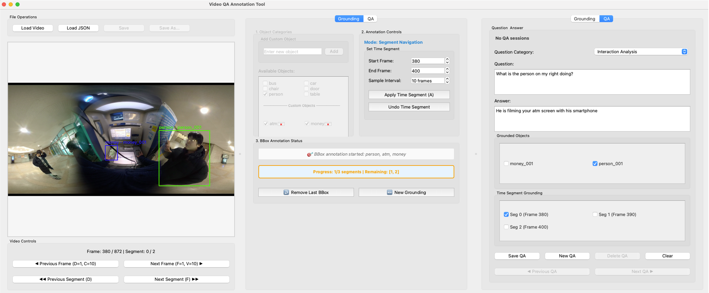
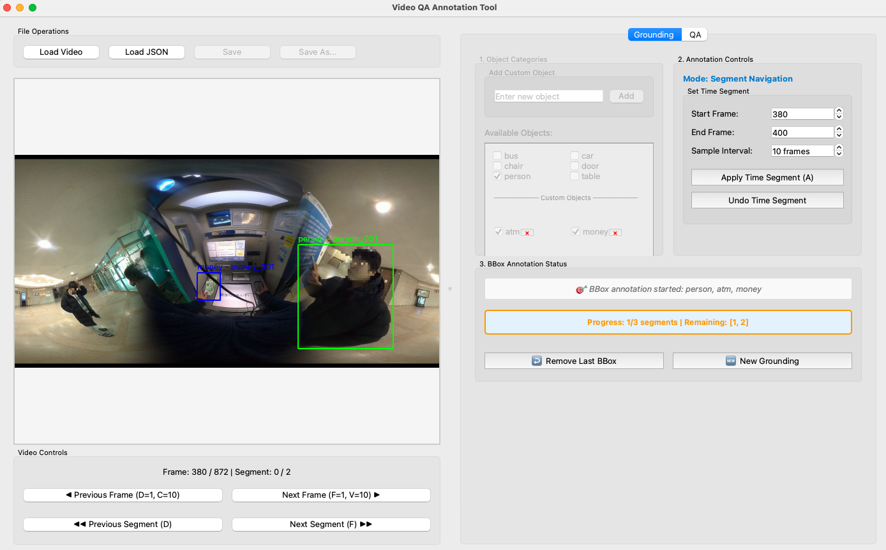
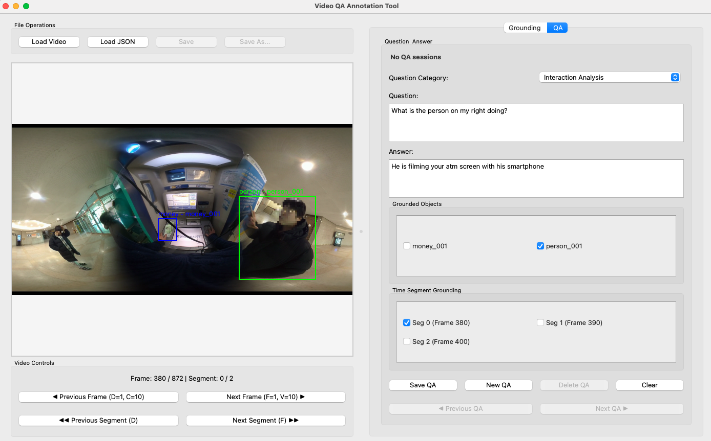

# Grounded Video Question Answering Annotation Tool

## Snapshots

### Main Interface (Grounding Tab)


### QA Annotation Interface (QA Tab)


## Requirements

- Python 3.9
- Dependencies: `pip install -r requirements.txt`

## Running the Application
```
python main.py
``` 

## Features
- **Video Loading** : MP4, AVI, MOV, MKV Formats supported
- **Object Category** : Pre-defined objects + Custom in-program object category addition
- **Uniform Time Segment Sampling**: Uniform sampling with configurable start/end frames and intervals (default interval=10 frame)
- **Bounding Box Annotation (+Edit Functionality)** : Bbox Resize & Transition
- **QA Annotation** : Question-Answer pair creation with object and temporal grounding
- **JSON Save/Load**

## Overall Workflow

Video Load $\rightarrow$ 1. Object Category Selection $\rightarrow$ 2. Time Segment Config & Uniform Sampling $\rightarrow$ 3. Bounding Box Annotation $\rightarrow$ QA Annotation $\rightarrow$ 4. Save

### Specific Instructions

### Step 1: Load Video

- Click `Load Video` button to select a video file
- Supported formats: MP4, AVI, MOV, MKV

### Step 2: Object Selection (Grounding Tab)

- In **1. Object Categories**, select objects to annotate
- Add custom objects (enter text and click `Add button`)
- Multiple object selection supported

### Step 3: Time Segment Configuration
- In **2. Annotation Controls**, set time range:
  - **Start Frame**: Starting frame number
  - **End Frame**: Ending frame number
  - **Sample Interval**: Sampling interval in frames
- Click `Apply Time Segment (A)` to apply

### Step 4: Bounding Box Annotation
- Bbox mode automatically activates after applying time segment
- Draw bboxes by mouse dragging
- Set Object Type and Track ID in the dialog
- Bbox editing features:
  - Select: Click on bbox
  - Move: Drag from inside
  - Resize: Drag edges/corners
  - Delete: Right-click or Delete key

### Step 5: QA Annotation (QA Tab)
- Switch to QA tab with Q key
- Enter question and answer
- Select related Track IDs in Grounded Objects
- Select relevant time segments in Time Segment Grounding
- Click `Save QA` to save

### Step 6: Save Annotation
- Use `Save` or `Save As...` to export annotations in JSON format

## Keyboard Mappings
### Navigation
- **D**: Previous frame/segment (1 frame)
- **F**: Next frame/segment (1 frame)
- **C**: Previous 10 frames
- **V**: Next 10 frames

### Annotation
- **A**: Apply Time Segment (Grounding tab only)
- **Q**: Switch to QA tab
- **Right-click**: Delete bbox
- **Delete/Backspace**: Delete selected bbox
- **Ctrl+Left-click**: Force new bbox drawing (even over existing bbox)

### Bbox Dialog
- **W**: Increase Track ID
- **S**: Decrease Track ID
- **Enter/Space**: Confirm
- **ESC**: Cancel

### File Management
- Ctrl+S: Save
- Ctrl+O: Load video
- Ctrl+R: Start new grounding (Same as `New Grounding` Button)

### QA Panel
- **Tab**: Move focus from question to answer
- **Shift+Tab**: Move focus from answer to question


## JSON Data File Format
Example below is dummy data.
```
{
  "video_info": {
    "filename": "sample_video",
    "total_frames": 300,
    "fps": 30.0,
    "resolution": {"width": 1920, "height": 1080}
  },
  "groundings": [
    {
      "grounding_id": 1,
      "created_at": "2025-07-02T10:30:00",
      "time_segment": {
        "start_frame": 0,
        "end_frame": 100, 
        "interval": 10,
        "sampled_frames": [0, 10, 20, 30, 40, 50, 60, 70, 80, 90, 100]
      },
      "selected_objects": ["person", "car"],
      "annotations": {
        "0": [
          {
            "x": 100, "y": 200, "width": 150, "height": 200,
            "object_type": "person", "track_id": "person_001"
          }
        ],
        "10": [...]
      },
      "qa_sessions": [
        {
          "qa_id": 1,
          "question_category": "Action Recognition",
          "question": "What is the person doing?",
          "answer": "The person is walking across the street.",
          "grounded_objects": ["person_001"],
          "temporal_grounding": {
            "time_segment_indices": [0, 1, 2],
            "frame_indices": [0, 10, 20]
          }
        }
      ]
    }
  ]
}
```